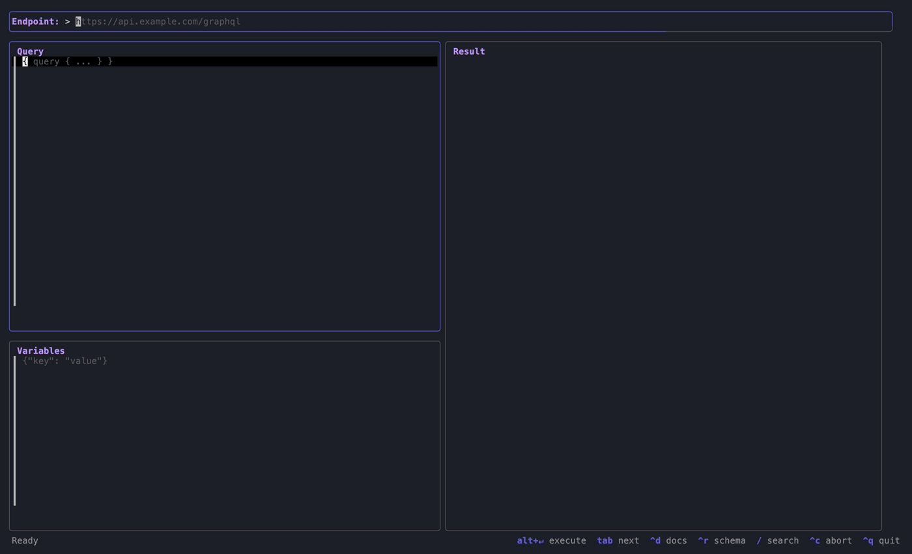

# qraqula

A terminal-based GraphQL client. Query, explore schemas, and manage results — all from your terminal.

Built with Go and [Bubble Tea](https://github.com/charmbracelet/bubbletea).



## Features

- **Query editor** with vim keybindings and GraphQL syntax highlighting
- **Schema introspection browser** — automatic introspection on connect, drill-down navigation, cross-level search, query generation from fields
- **Result viewer** with syntax-highlighted JSON, scrolling, and search
- **Variables panel** with JSON syntax highlighting and validation
- **External editor** — open query or variables in `$EDITOR` with `Ctrl+O`
- **Schema-aware linting** — validates queries against the schema before execution
- **Query history** — auto-saved on execution, organized in folders with timestamps, scrollable sidebar with delete confirmation
- **Query abort** — cancel running queries instantly with `Ctrl+C`
- **Environments & headers** — named environments (dev/staging/prod) with endpoint, headers, and variables; global headers; cycle between envs
- **Status bar** with response metadata (status code, response time, size)

## Install

### Homebrew

```sh
brew install Quietscher/qraqula/qla
```

### From source

```sh
go install github.com/qraqula/qla@latest
```

## Usage

```sh
qla
```

Set your GraphQL endpoint URL in the top bar, write a query in the editor, and press `Alt+Enter` to execute.

## Keybindings

### Global

| Key | Action |
|---|---|
| `Alt+Enter` | Execute query |
| `Ctrl+C` | Abort running query |
| `Ctrl+Q` | Quit |
| `Tab` / `Shift+Tab` | Cycle between panels |
| `Ctrl+H/J/K/L` | Navigate between panels directionally |
| `Ctrl+D` | Toggle results / schema browser |
| `Ctrl+R` | Refresh schema |
| `Ctrl+E` | Open environments & headers overlay |
| `Ctrl+N` | Cycle active environment |
| `Ctrl+B` | Toggle history sidebar |
| `Ctrl+O` | Open in `$EDITOR` (query/variables) |

### Result Viewer

| Key | Action |
|---|---|
| `/` | Toggle search |
| `n` | Next match |
| `N` | Previous match |

### Schema Browser

| Key | Action |
|---|---|
| `j` / `k` | Navigate up/down |
| `l` / `Enter` | Drill into type |
| `h` / `Backspace` | Go back |
| `g` | Generate bare query body from selected field |
| `G` | Generate full operation with variables from selected field |
| `v` | View field arguments |
| `/` | Search (cross-level, includes variable types) |
| `Esc` | Clear search |

### History Sidebar

| Key | Action |
|---|---|
| `j` / `k` | Navigate up/down |
| `Enter` / `l` | Load entry or toggle folder |
| `h` | Collapse folder |
| `N` | New folder |
| `r` | Rename |
| `d` | Delete (folders require confirmation) |
| `m` / `M` | Move entry to next/previous folder |
| `/` | Search |

## Configuration

Query history is stored at `~/.config/qraqula/history/` in human-readable JSON.

Environment and header configuration is stored at `~/.config/qraqula/config.json`.

## Security

**Headers and environment configuration are stored in plaintext JSON** on disk at `~/.config/qraqula/config.json`. This includes any authentication tokens, API keys, or other sensitive values you add as headers.

- Do not store production secrets in qraqula if your machine is shared or unencrypted
- The config file has standard user-only file permissions, but is not encrypted

## License

MIT

## Disclaimer

This software is provided "as is", without warranty of any kind, express or implied. The author(s) are not responsible for any data loss, security breaches, leaked credentials, or damages arising from the use of this software. You use qraqula entirely at your own risk.

By using qraqula you acknowledge that:
- Authentication tokens, API keys, and other secrets entered into the application are stored **unencrypted in plaintext** on your local filesystem
- It is your responsibility to secure your machine and the configuration files
- The author(s) accept no liability for unauthorized access to credentials stored by this tool
- You are solely responsible for compliance with any applicable policies when connecting to third-party APIs

### GraphQL Trademark

"[GraphQL](https://graphql.org)" is a registered trademark of [The GraphQL Foundation](https://graphql.org/foundation/). This project is not affiliated with, endorsed by, or associated with The GraphQL Foundation.

qraqula is an independent open source project that implements a client for the [GraphQL specification](https://spec.graphql.org).
